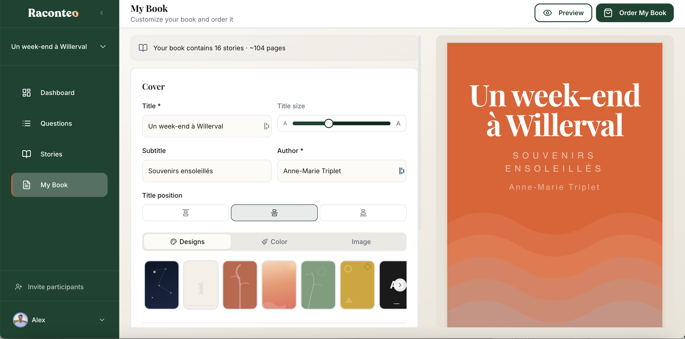
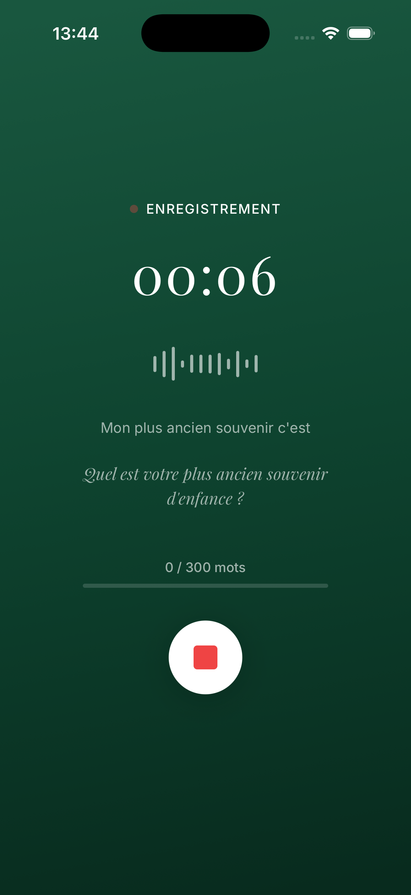

# Raconteo

> **Every life deserves to be told.**

Raconteo helps elderly people capture and transform their life stories into beautiful, readable chapters — and ultimately a printable book they can leave to their family.

---

## The Problem

Most seniors have extraordinary stories to tell — but writing them down feels overwhelming. A blank page is intimidating. Technology gets in the way. And the stories that matter most often go untold.

Raconteo removes every barrier.

---

## How It Works

**1. 🎙️ Pick a theme and answer 3 guided questions**
Choose from 10 life themes (childhood, work, love, travel, resilience…). Answer at your own pace — by voice or by typing. One question at a time. No overwhelm.

**2. ✨ AI generates a warm, polished chapter**
Gemini listens, transcribes, and writes a 300–600 word chapter that sounds like *you* — not a robot. It asks gentle follow-up prompts ("Who was there? What did it smell like?") to enrich the story.

**3. 📖 See your life take shape as a book**
Every chapter appears in a beautiful book preview. Watch your memoir grow, theme by theme.

**4. 🖨️ Export and print**
When ready, export as a print-ready PDF. Order a physical copy, or share digitally with family.

---

## Key Features

- **Voice-first interface** — designed for people who've never written a memoir
- **One question at a time** — no cognitive overload, no blank page anxiety
- **AI that enriches, not replaces** — gentle prompts pull out the details that make stories come alive
- **Retouching in plain language** — "Make it warmer" or "Adapt for a grandchild" — no tech skills needed
- **Emotional reward loop** — the book preview makes every chapter feel like an achievement
- **Shareable stories** — invite family members to read or add their own memories

---

## Tech Stack

| Layer | Tech |
|---|---|
| Frontend | Next.js + TypeScript + TailwindCSS |
| Auth & Database | Supabase (PostgreSQL + RLS) |
| AI | Gemini API (transcription + generation) |
| Deployment | Vercel |

---

## Status

🟠 **Beta** — ~20 active users. App Store submission in progress.

---

## Links

- 🌐 **Live app**: [raconteo.com](https://raconteo.com)
- 📬 **Contact**: [alexandre@raconteo.com](mailto:alexandre@raconteo.com)

---

*Built for the people who have the most to say, and the least time left to say it.*
